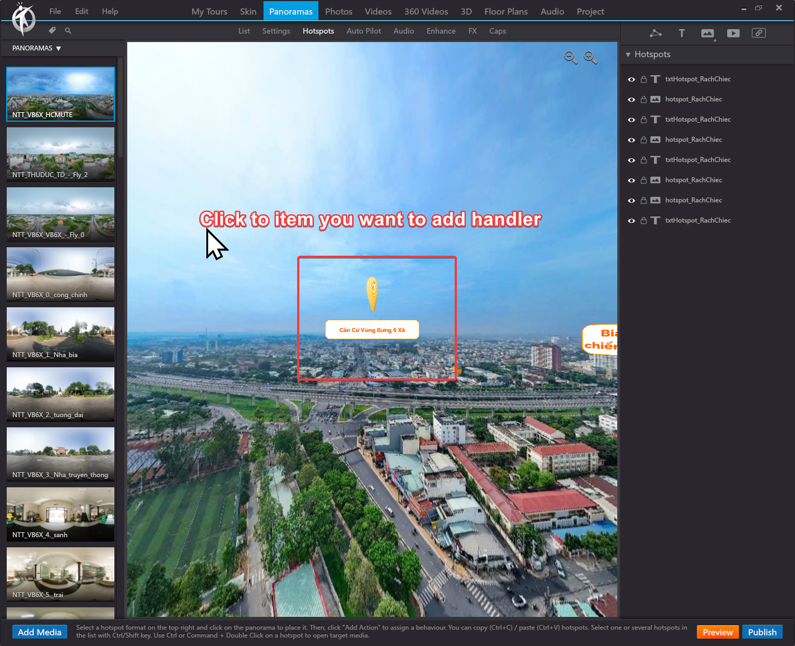
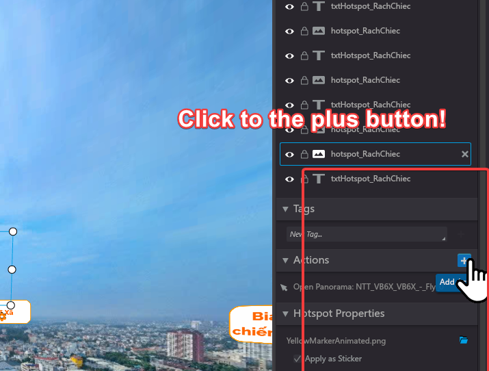
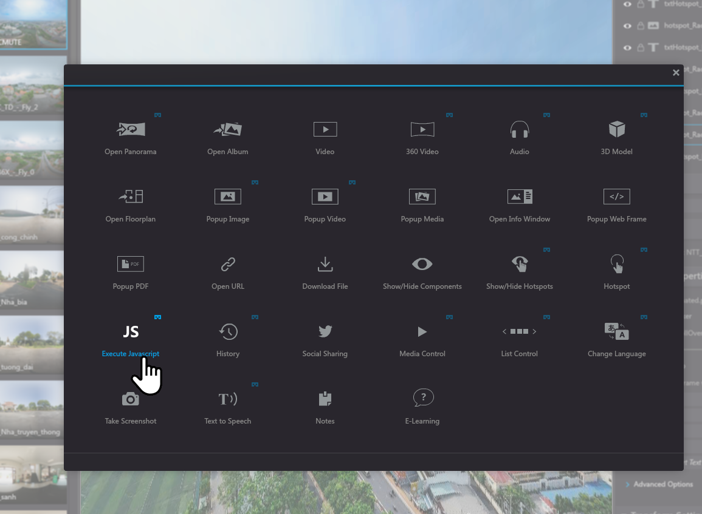
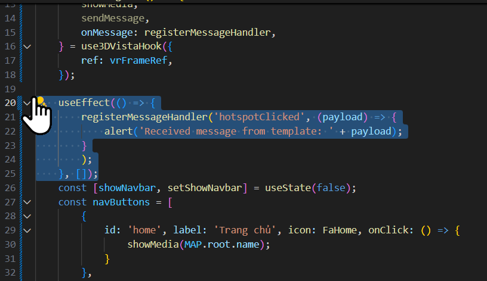

### How to make a VR workflow

1. **Create a new workflow**: In the 3D Vista Editor, create a new workflow. This will be the main container for your VR experience.

2. Here is the library of the workflow:
   - **Bridge**: This is a JavaScript file that will be used to communicate between the 3D Vista iframe and the parent window. It will handle messages sent from the iframe and send messages back to the iframe.
   - **VR Tour**: This is the main 3D Vista tour that will be embedded in the iframe. It will contain all the media and interactions for your VR experience.

```js
/* ************************************************************************** */
/*                                                                            */
/*                                                        :::      ::::::::   */
/*   bridge.js                                          :+:      :+:    :+:   */
/*                                                    +:+ +:+         +:+     */
/*   By: deno <tctoan1024@gmail.com>                +#+  +:+       +#+        */
/*                                                +#+#+#+#+#+   +#+           */
/*   Created: 2025/05/01 10:16:12 by deno              #+#    #+#             */
/*   Updated: 2025/05/01 10:16:12 by deno             ###   ########.fr       */
/*                                                                            */
/* ************************************************************************** */

function sendMessageToParent(type = "message", payload = null, target = "*") {
  window.parent.postMessage({ type, payload }, "*"); // Change '*' to specific origin if needed
}

window.addEventListener("DOMContentLoaded", function () {
  sendMessageToParent("ready", null, "*");
  console.log("3DVista Bridge is ready");
});
```

First: For each marker, item in 3D Vista we'll have a function that will be called when the marker is clicked. This function will send a message to the parent window with the type of the event and the payload (data) that we want to send.

### STEP 1: Choose the item you want to add the event to. In this case, we will use the "Marker" item.



### STEP 2: Click to the "Actions" tab and select the "Execute JavaScript" action.



### STEP 3: Choos the Javascript option:



### STEP 4: Add the code to send the message to the parent window.

```js
sendMessageToParent("marker_clicked", { markerId: "marker_1" });
```

### STEP 5: Add the handler to the use3DVistaHook to listen for the message from the iframe.



### STEP 6: YOLO!!! YOU DID IT!!!

Note: Please remmeber to follow our rule, the follow the name I put on the project file.
Contact: 0769394157
